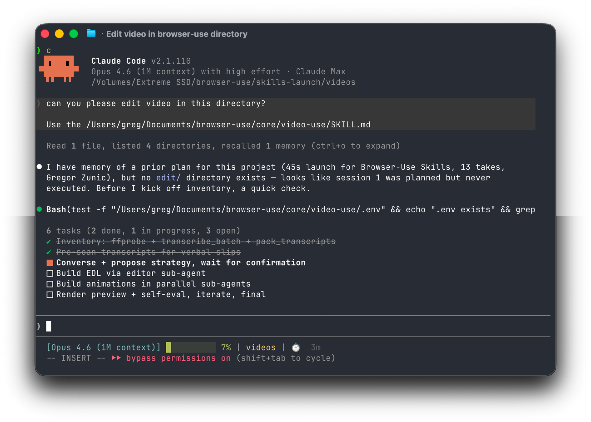

<p align="center">
  
</p>

# Video

Conversation-driven video skill. **Primary mode: style mimic** — copy another video's subtitle look, keyword motion, top title bars, and upper-frame FX onto your footage. Also supports general cut / grade / edit.

**ASR:** local [OpenAI Whisper](https://github.com/openai/whisper) (default **`tiny`**). No cloud API key.

### Style mimic quick start

```bash
python helpers/apply_style.py \
  --source /path/to/raw.mp4 \
  --reference /path/to/style_ref.mp4 \   # optional local reference
  --edit-dir /path/to/edit \
  --style styles/ma_dage.yaml \
  --title "你的顶部议题" \
  --keywords "关键词1,关键词2" \
  --language zh
```

Shipped profile `styles/ma_dage.yaml` targets 马大个-class kinetic Chinese captions (large type, yellow keyword pop, top bar).

## What it does

- **Cuts out filler and dead space** between takes using word-level timestamps
- **Auto color grades** every segment (warm cinematic, neutral punch, or any custom ffmpeg chain)
- **30ms audio fades** at every cut so you never hear a pop
- **Burns subtitles** in your style — 2-word UPPERCASE chunks by default, fully customizable
- **Generates animation overlays** via HyperFrames, Remotion, Manim, or PIL — parallel sub-agents
- **Self-evaluates** the rendered output at every cut boundary before showing you anything
- **Persists session memory** in `project.md`

## Setup

```bash
cd /path/to/Video
uv sync                         # or: pip install -e .
# ffmpeg on PATH (required)
# first transcribe downloads Whisper tiny weights (~75MB)

# register with your agent (example: Grok)
ln -sfn "$(pwd)" ~/.grok/skills/Video
```

See [`install.md`](./install.md) for agent-specific registration and full checks.

Then point your agent at a folder of raw takes:

```bash
cd /path/to/your/videos
# start agent, then:
# > edit these into a launch video
```

Outputs land in `<videos_dir>/edit/` — the skill directory stays clean.

## How it works

The LLM never watches the video. It **reads** it — through two layers:

**Layer 1 — Audio transcript (always loaded).** Local Whisper with word-level timestamps packs all takes into `takes_packed.md` — the primary reading view.

```
## C0103  (duration: 43.0s, 8 phrases)
  [002.52-005.36] Ninety percent of what a web agent does is completely wasted.
  [006.08-006.74] We fixed this.
```

**Layer 2 — Visual composite (on demand).** `timeline_view` produces a filmstrip + waveform PNG for any time range. Called only at decision points.

## Pipeline

```
Transcribe (Whisper tiny) ──> Pack ──> LLM Reasons ──> EDL ──> Render ──> Self-Eval
                                                                              │
                                                                              └─ issue? fix + re-render (max 3)
```

## Design principles

1. **Text + on-demand visuals.** No frame-dumping. The transcript is the surface.
2. **Audio is primary, visuals follow.** Cuts come from speech boundaries and silence gaps.
3. **Ask → confirm → execute → self-eval → persist.** Never touch the cut without strategy approval.
4. **Zero assumptions about content type.** Look, ask, then edit.
5. **12 hard rules, artistic freedom elsewhere.** Production-correctness is non-negotiable. Taste isn't.

See [`SKILL.md`](./SKILL.md) for the full production rules and editing craft.

## Transcription

```bash
python helpers/transcribe.py clip.mp4                  # tiny (default)
python helpers/transcribe.py clip.mp4 --model base     # better accuracy
python helpers/transcribe.py clip.mp4 --language zh
python helpers/transcribe_batch.py /path/to/takes
```

Transcripts are cached under `edit/transcripts/<stem>.json` in a word-level schema shared by pack / render / timeline tools.
